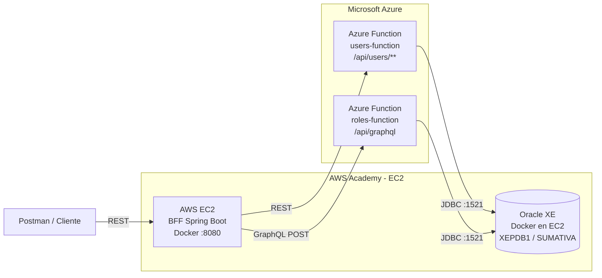

# Diagrama de Arquitectura Final

## Responsabilidades

- **BFF**: orquesta las llamadas y no accede directamente a Oracle.
- **users-function**: implementa REST para usuarios y asignación de roles.
- **roles-function**: implementa GraphQL para roles.
- **Oracle XE**: se ejecuta como contenedor en la misma máquina virtual EC2 que el BFF.
- **Postman**: se usa para evidenciar llamadas REST y GraphQL.
